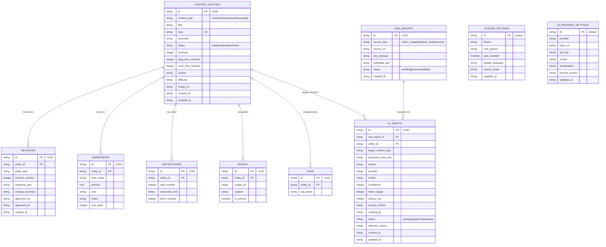

# Database ER Diagram & Architecture Documentation

## Entity-Relationship Diagram (Mermaid)

---

## Data Schema Summary

1. **`content_entities`**: Core polymorphic table for Recipes, Techniques, Ingredient Guides, Sauces, Spice Blends, and Kitchen Tips. Uses UUID primary keys and strict unique slugs.
2. **`ingredients` & `instructions`**: Relational sub-tables for structured recipe components.
3. **`images` & `tags`**: Gallery images & categorizations per content entity.
4. **`revisions`**: Immutable audit history log tracking version numbers, change summaries, and snapshot states upon approval.
5. **`raw_imports`**: Preserved raw source payloads (URLs, raw OCR output, plain text dumps) enabling future prompt re-processing.
6. **`ai_drafts`**: Mandatory staging table for AI-generated proposals featuring confidence metrics, token usage, latency tracking, prompt versioning, and rationale summaries.
7. **`system_settings`**: General app preferences (theme, metric/imperial, PWA toggles).
8. **`ai_provider_settings`**: Provider-agnostic AI Gateway configurations (OpenAI, DeepSeek, Groq, Ollama).
